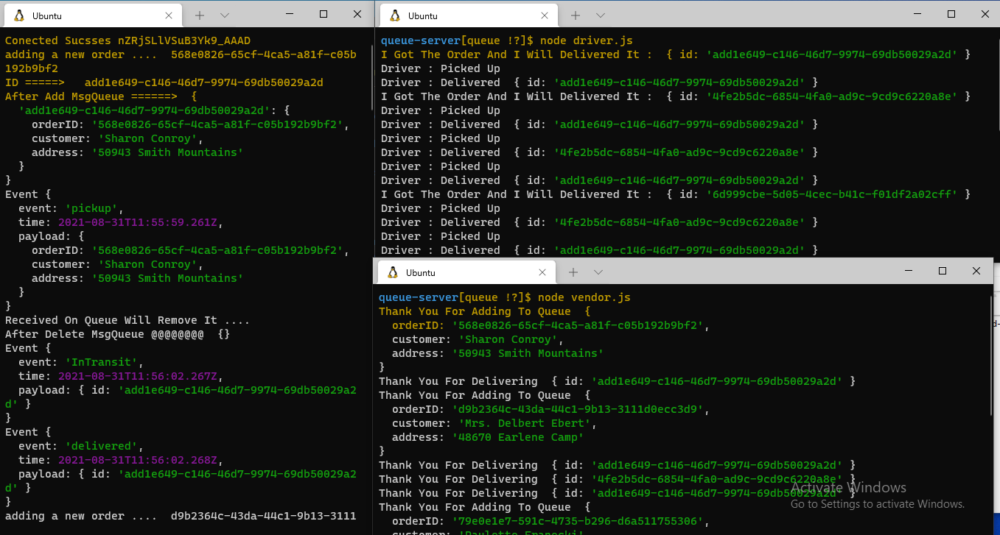

# caps

## Links and Resources:

* ### Github Actions:

https://github.com/Mahmoud-Khader/caps/actions

* ### pull request :
https://github.com/Mahmoud-Khader/caps/pull/3

## Setup 
### .env requirements :
* ### STORE_NAME=MyStore

## Dependencies needs to install
* ### npm init -y
* ### npm i dotenv express cors 
* ### npm i -D jest supertest 
* ### npm i faker 
* ### npm i uuid
* ### npm i socket.io
* ### npm i socket.io-clint

### console output :

### Run tests with :
 * ### npm run test

* UML

